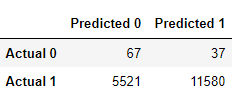
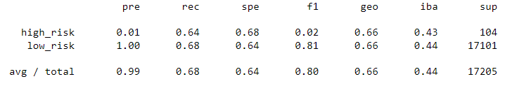
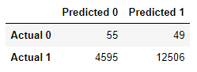
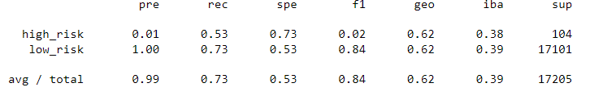
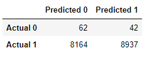
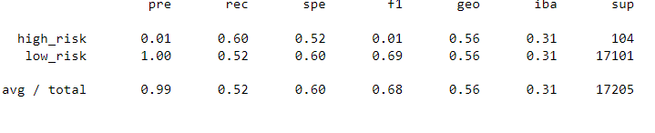
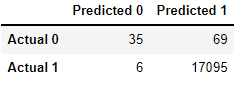
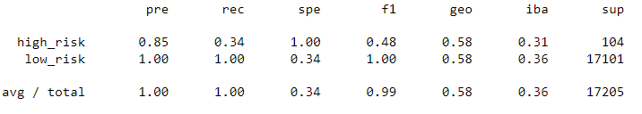
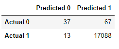
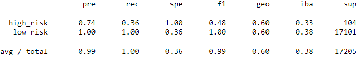

# Credit_Risk_Analysis

## Overview

~ 100,000 People were classified according to their credit risk using six different supervised machine learning models:
  * Random Oversampling
  * SMOTE
  * SMOTEENN
  * Undersampling via ClusterCentroids algorithm
  * Balanced Random Forest
  * Easy Ensemble Classifier

## Results

Each model performed differently according to their balanced accuracy scores, confusion matrices, and imbalanced classification reports.

### Random Over Sampler:

balanced accuracy score: .65

confusion matrix:

imbalanced classification report:

### SMOTE:

balanced accuracy score: .65

confusion matrix:

imbalanced classification report:

### SMOTEENN:

balanced accuracy score: .65

confusion matrix:

imbalanced classification report:

### ClusterCentroids:

balanced accuracy score: .65

confusion matrix:

imbalanced classification report:

### Balanced Random Forest:

balanced accuracy score: .65

confusion matrix:

imbalanced classification report:

### Easy Ensemble:

balanced accuracy score: .65

confusion matrix:

imbalanced classification report:

## Summary
